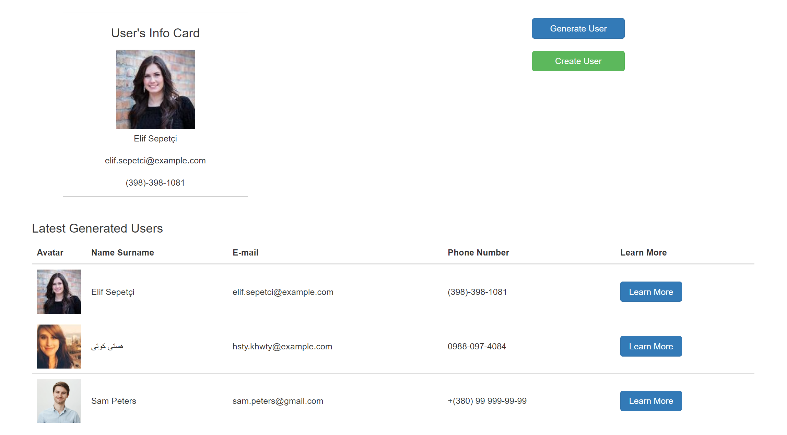

# jQuery-Bootstrap-UsersGenerator

## About Project

This is a jQuery-based user's generator that creates new users both ways:

-   from an API (random generation) - you have an option to choose a gender
-   from a form

## Screenshots:

### Main Page

## Used technologies and libs/plugins:

-   jQuery
-   jQuery Mask Plugin
-   jQuery Validation Plugin
-   Bootstrap
-   SCSS

## Acknowledgments

This project was made possible by the API provided by [Random User Generator](https://randomuser.me/).\
